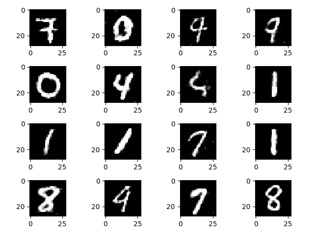

# PyTorch-Mnist-GAN
This project implements a Generative Adversarial Network (GAN) using PyTorch, aimed at generating digit images similar to those found in the MNIST dataset. The architecture of this GAN is intentionally kept simple, utilizing basic linear layers to construct both the generator and the discriminator. Despite its simplicity, this test framework demonstrates the fundamental capabilities of GANs to generate new, synthetic images that mimic the style of handwritten digits. It serves as a straightforward example of applying GANs and provides a solid foundation for understanding and experimenting with more complex generative models. This project is perfect for educational purposes or as a starting point for more advanced GAN experiments.

# Usage
    python3 train.py

# Example
  

# More Informations
My Blog: https://clay-atlas.com/blog/2020/01/09/pytorch-chinese-tutorial-mnist-generator-discriminator-mnist/
